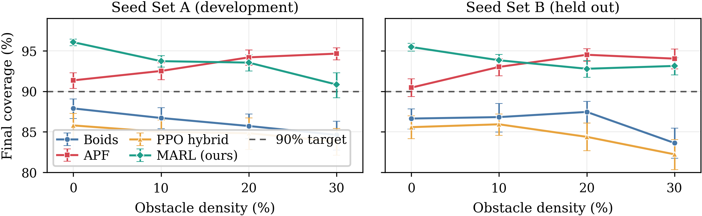

# Decentralised UAV Swarm Coverage with Multi-Agent Reinforcement Learning

Six UAVs search an unknown, obstructed area. No central controller, no map, and
no messages between them. Each agent sees a 7×7 window — 21 m of a 150 m block —
and decides alone.


*Left: a tuned Artificial Potential Field controller. Right: the parameter-shared
multi-agent PPO policy. Same obstacle layout, same start, same 700-step budget.
Coverage is live. The learned agents split the area between them without
exchanging a single message.*

---

## What this is

My MSc Robotics dissertation (Bristol / UWE, 2026), rebuilt as a reproducible
research repository. Four controllers compared under identical conditions across
**1,600 runs**: Boids flocking, Artificial Potential Fields, a single-agent PPO
hybrid, and a fully decentralised multi-agent PPO policy.

The interesting result is not the one I expected.

## Three findings

**1 — A decentralised learned policy matches classical control, and beats it in
open ground.**

Clears the 90% search-and-rescue coverage target in all eight
density-by-seed-set conditions. Beats APF by 4.7 and 5.0 percentage points at 0%
obstacles; statistically indistinguishable at 10% and 20%; slightly behind at
30%, and that deficit does not replicate on held-out layouts.



**2 — The reward scheme mattered more than the architecture.**

Holding the network, budget, seed, observations and dynamics fixed and changing
**only** how reward is assigned — from crediting each agent for the ground it
reaches first, to the shared team total — costs **30.6 percentage points**, and
not one run of fifty reaches the target.

That gap is larger than the distance between any two controllers in the study.
Credit assignment is not a refinement on the architecture; it decides whether the
controller works at all.

**3 — Percentage coverage misleads when free area varies.**

APF *appears* to improve as obstacle density rises. In absolute cells it covers
**640 fewer** at 30% density than at 0% — the free area simply shrinks faster.
Any study varying obstacle density while reporting only a coverage ratio invites
the same misreading.

## How it was measured

Comparisons are paired, not parallel. Each seed produces a byte-identical
obstacle layout for all four controllers, verified cell by cell before any test
runs.

- 1,600 runs: 4 controllers × 4 obstacle densities × 50 seeds × 2 disjoint seed sets
- Paired Wilcoxon signed-rank with Holm–Bonferroni correction within each family
- Matched-pairs rank-biserial correlation and Cliff's δ for effect size
- 10,000-resample bootstrap confidence intervals, seeded
- Seed Set B held out entirely until the end

## What I got wrong, and fixed

An audit of my own apparatus found three defects, all reported in the
dissertation rather than quietly corrected:

- **A retracted result.** An earlier draft reported 95.0% for the memory-free
  policy. That checkpoint could not be reproduced; the surviving one scores
  90.0%, which reverses the conclusion drawn from it.
- **An undertrained budget.** Four training seeds spread 7.8 points at 20%
  density. Trained to 1.85M steps the spread halves and every seed overtakes APF
  — so at that density the training budget, not the method, set the result.
- **Uncontrolled obstacle seeding.** The environment originally drew layouts from
  the simulator's internal RNG rather than the supplied seed, so one seed gave
  three different maps. Fixed and verified before any reported result was
  generated.

## Repository layout

```
code/
  phase2_boids/     Boids controller, world model, obstacle generator
  phase3_apf/       Artificial Potential Fields controller
  phase4_ppo/       single-agent PPO hybrid, Gymnasium environment
  phase5_marl/      parameter-shared multi-agent PPO: environment, training,
                    evaluation, and 14 trained checkpoints
  analysis/         statistics, extended metrics, figure and animation generation
latex_final/        LaTeX source, figures, compiled dissertation
```

## Running it

```bash
python3 -m venv .venv && source .venv/bin/activate
pip install -r code/requirements-lock.txt
cd code

python3 -m analysis.statistical_tests      # every test and table in the paper
python3 -m analysis.absolute_cells_50      # absolute-cell accounting
python3 -m analysis.make_report_figures    # all plotted figures
python3 -m analysis.make_swarm_animation   # the animation above
```

These read stored results and trained checkpoints and regenerate every number
and figure. Obstacle generation uses `numpy.random.default_rng(seed)` and is
deterministic: seed 7 at 20% density gives 1,991 free cells on any machine.

Use `requirements-lock.txt`. `requirements.txt` pins `mesa==3.0.3`, which is
stale — the results were produced under mesa 3.5.1.

**Do not run `train_*.py` to reproduce results.** `train_marl.py` resumes from an
existing checkpoint and overwrites it, so running it replaces the 1.00M-step
models the reported figures come from. PPO training is not bit-reproducible
across hardware in any case.

## Stack

Python 3.13 · PyTorch · Stable-Baselines3 (PPO) · Gymnasium · Mesa · NumPy ·
SciPy · Matplotlib

## Limitations

A 2D kinematic grid with perfect sensing and localisation: no inertia, wind or
battery model, so only the relative ordering plausibly transfers to hardware. The
learned controller carries onboard-memory features the classical controllers lack,
and on equal information APF wins at both budgets tested. The main experiment uses
one training seed per condition at a budget the seed study shows to be
undertrained.
